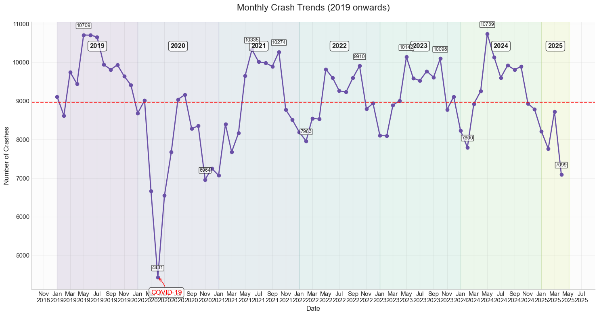
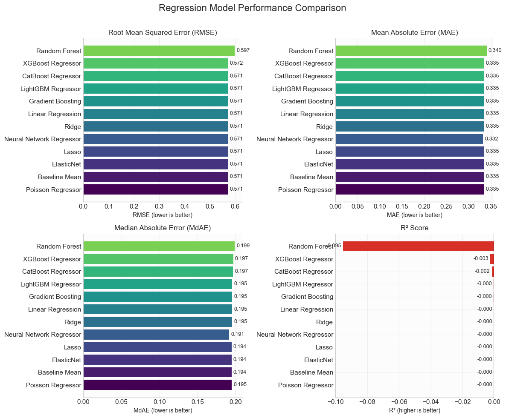
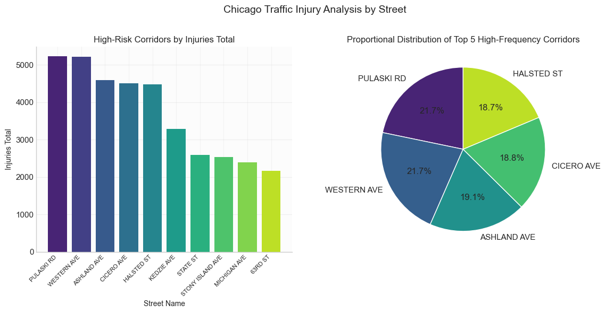
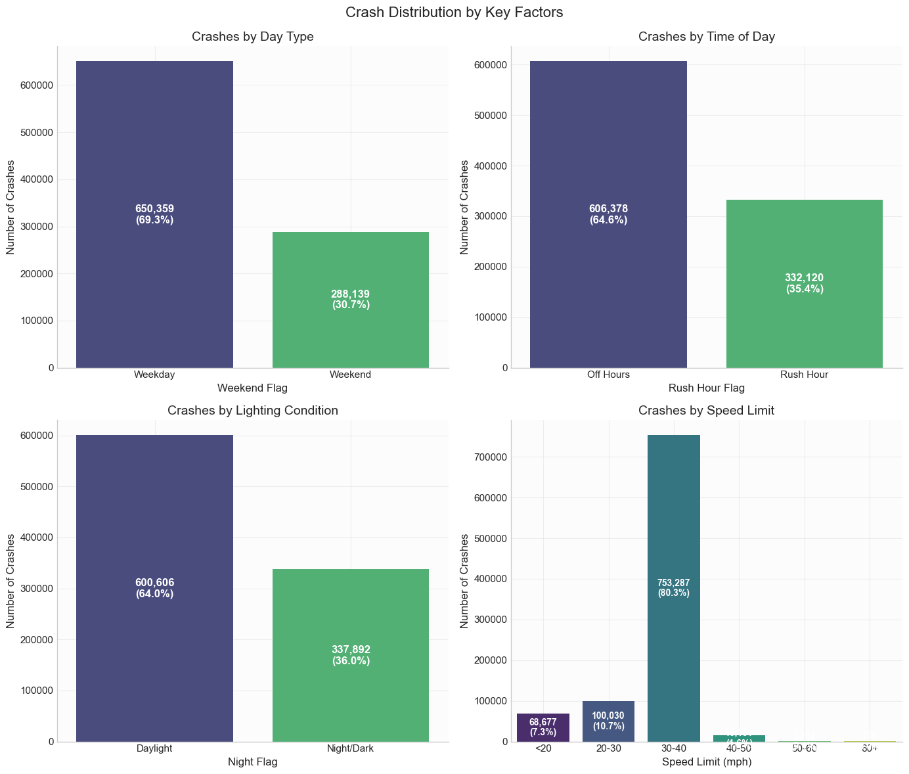

# Chicago Traffic Crashes Analysis: Safer or Riskier?

## Interactive Visualizations & Resources
This project features interactive visualizations that can be accessed through GitHub Pages:

- **Chicago Crash Heatmap**: [Geographic visualization of crash hotspots](https://anandm0101.github.io/Data_Science_2025/chicago_crash_heatmap.html)
- **Interactive Dashboard**: [Comprehensive visualization dashboard](https://anandm0101.github.io/Data_Science_2025/dashboard.html)

### Data and Model Files
For access to the full dataset and trained models, visit our Google Drive folder:
https://drive.google.com/drive/folders/1-Ya0oYD0vHRCQ1Co_WEk_BhALgiJkHdd

## Overview
This project analyzes the City of Chicago's Traffic Crashes data to understand where, when, and why motor-vehicle collisions occur. Motor-vehicle collisions are one of the leading causes of injury and property loss in Chicago. Our aim is to provide evidence-based insights that can help make Chicago roads safer for drivers, cyclists, and pedestrians alike.

## Team
| Name | Email | GitHub |
|------|-------|--------|
| Meena Anand | ameen4@uic.edu | [GitHub](https://github.com/anandm0101) |
| Kodati Shruthi | skoda13@uic.edu | [GitHub](https://github.com/shruthikodati) |
| Siddhi Dabholkar | sdabh@uic.edu | [GitHub](https://github.com/siddhidabholkar10) |
| Karthik Kumar Muppala | kmupp@uic.edu | [GitHub](https://github.com/m-karthik-kumar) |
| Naga Malleshwar Reddy Lingala | nling4@uic.edu | [GitHub](https://github.com/malleshwar) |

## Key Facts
- According to the latest figures, Chicago logged about 112,000 crash reports in 2024, and nearly 30,000 additional crashes by the first week of April 2025
- This project leverages the publicly available Traffic Crashes dataset from the City of Chicago Data Portal
- Our analysis covers approximately 938,000 crash records with 48 columns of crash context and outcomes
- We focus on recent patterns and trends to identify high-risk factors and locations

## Problem Statement and Research Questions
Motor-vehicle collisions in Chicago pose a significant public-health and economic challenge: each year, the city's traffic crash reports document hundreds of thousands of incidents that collectively result in thousands of injuries, hundreds of fatalities, and tens of millions of dollars in direct and indirect costs (emergency response, medical care, lost productivity, and infrastructure damage).

While the City has invested heavily in roadway redesign, traffic-signal timing, speed-limit enforcement, and public-awareness campaigns, decision-makers still lack a cohesive, data-driven framework for understanding which specific contextual factors most strongly drive injury severity.

Our research questions include:

1. **Contextual Risk Factors**: Which environmental (weather, lighting) and operational (posted speed limits, traffic-control devices, time of day) conditions are most closely associated with higher numbers of injuries per crash?

2. **Predictive Modeling of Injury Counts**: Can a regression model, trained solely on crash context and engineered features (e.g., weekend vs. weekday, rush-hour flags, speed-limit bins), accurately predict the total number of injuries in an individual collision?

3. **Geospatial Hot-Spot Identification**: Where do the most severe crashes (regarding injury counts) cluster geographically?

## Data Sources
The primary dataset used in this analysis comes from the City of Chicago Data Portal:
- [Traffic Crashes - Crashes](https://data.cityofchicago.org/Transportation/Traffic-Crashes-Crashes/85ca-t3if/about_data)

This dataset contains detailed information about each crash reported by the Chicago Police Department through their electronic crash reporting system (E-Crash).

### Data Preprocessing
Our data preprocessing workflow included:

1. **Date/Time Parsing**: Converting CRASH_DATE from strings to datetime format to extract:
   - CRASH_YEAR, CRASH_MONTH, CRASH_DAY
   - CRASH_WEEKDAY (0=Monday to 6=Sunday)
   - CRASH_HOUR (0-23)

2. **Sparse Column Pruning**: Removed 11 fields with more than 50% missing values (e.g., LANE_CNT, WORK_ZONE_TYPE, INTERSECTION_RELATED_I)

3. **Missing Value Imputation**:
   - Categorical fields: Filled blanks with "UNKNOWN" (REPORT_TYPE, STREET_DIRECTION, STREET_NAME, MOST_SEVERE_INJURY)
   - Injury counts: Assumed missing values were zero for INJURIES_FATAL, INJURIES_INCAPACITATING, etc.
   - Geolocation: Dropped ~0.7% of rows missing both LATITUDE and LONGITUDE
   - Police beat: Filled remaining nulls in BEAT_OF_OCCURRENCE with the median value

## Project Structure
```
├── crash_analysis_results/     # Visualizations and analysis outputs
│   ├── classification_metrics.png
│   ├── crash_density_map.png
│   ├── crash_types.png
│   ├── daily_crashes.png
│   ├── dashboard.html
│   ├── hourly_crashes.png
│   ├── injury_by_cause.png
│   ├── injury_by_crash_type.png
│   ├── injury_by_weather.png
│   ├── monthly_crashes.png
│   ├── monthly_trends.png
│   ├── prediction_distributions.png
│   ├── regression_metrics.png
│   ├── street_injury.png
│   ├── temporal_heatmap.png
│   ├── time_period_viz.png
│   └── weekday_donut.png
├── docs/                       # GitHub Pages documentation
│   ├── chicago_crash_heatmap.html
│   └── dashboard.html
├── .gitignore
├── final.ipynb                 # Final analysis notebook
├── Progress_Report.ipynb       # Development progress tracking
└── README.md                   # This file
```

## Methodology
Our approach combines:

1. **Rigorous data cleaning and imputation**: Handling missing values, standardizing formats, and creating derived features.

2. **Exploratory visual analysis**: Using histograms, boxplots, heatmaps, and geographic visualizations to identify patterns.

3. **Advanced machine learning techniques**:
   - **Clustering**: DBSCAN for geographic crash hotspot identification
   - **Classification**: Predicting crash severity using multiple algorithms (Random Forest, XGBoost, SVM, Neural Networks)
   - **Regression**: Predicting injury counts with various models (Linear models, Tree-based ensembles)
   - **Feature importance analysis**: Identifying the most influential factors in crash outcomes

## Key Findings
Based on our comprehensive analysis of Chicago traffic crash data:

1. **Driver behavior is the primary cause of crashes**, not weather or road conditions
   - Most crashes occur in clear weather (64%) and daylight (64%), not during adverse conditions
   - Failing to yield and speeding are the leading contributory factors to injuries

2. **Temporal patterns show distinct peaks**
   - Evening rush hour (3-5 PM) shows the highest crash frequency
   - Late-night and early morning hours (1-4 AM) show the highest fatal crash rates
   - Friday is the day with the highest overall crash frequency

3. **Geographic risk is concentrated**
   - Pulaski Road and Western Avenue are the highest-risk corridors based on total injuries
   - Crash hotspots concentrate along major traffic corridors and downtown

4. **Speed and environment matter**
   - Most crashes (~89.5%) occur on roads with 30-40 mph speed limits
   - Pedestrian (~90%) and cyclist (~75%) crashes carry the highest injury risks
   - The per-hour crash rate is much higher at night than during daylight hours

5. **Machine learning insights**
   - Time-based features (CRASH_HOUR, CRASH_MONTH) and POSTED_SPEED_LIMIT are the most influential predictors
   - Tree-based ensemble models (Random Forest, XGBoost) outperformed traditional models in predicting crash severity

## Recommendations
From our analysis, we recommend the following interventions to improve traffic safety in Chicago:

1. **Target high-risk corridors and times**
   - Focus enforcement and infrastructure improvements on Pulaski Road and Western Avenue
   - Enhance safety measures during evening rush hours (3-5 PM) and late-night/early morning hours (1-4 AM)

2. **Prioritize vulnerable road users**
   - Implement specific countermeasures for pedestrian and cyclist safety
   - Improve visibility and signage at high-risk intersections

3. **Address behavioral factors**
   - Develop targeted education campaigns about yielding right of way and speed reduction
   - Focus enforcement on the most dangerous driving behaviors

4. **Use predictive analytics**
   - Deploy predictive models to allocate resources proactively to areas with elevated crash risk
   - Identify emerging hotspots before they become high-injury locations

5. **Enhance data collection**
   - Improve recording of contributing factors to better understand crash causality
   - Integrate crash data with traffic volume data for more accurate risk assessment

## Data Visualizations & Insights

Our analysis produced a wide range of visualizations that reveal important patterns in Chicago traffic crashes:

### 1. Model Performance


**Key Insights:** 
- Neural Network, XGBoost, and CatBoost models achieved the highest overall performance scores (0.604)
- The Voting Classifier (0.601) demonstrated the benefit of ensemble techniques
- All models showed strong accuracy (>0.8) but varied in precision-recall balance

### 2. Crash Density Map


**Key Insights:**
- The map shows over 931,500 crashes distributed across Chicago city limits
- Higher crash densities (orange/yellow) are concentrated in the central and north side areas
- Major road corridors show significantly higher crash frequencies
- Areas with lower population density or fewer major roads show reduced crash frequencies

### 3. Top Crash Types


**Key Insights:**
- Parked Motor Vehicle (217,091) and Rear End (206,548) crashes are by far the most common types
- These two categories alone account for over 423,000 crashes
- Sideswipe Same Direction (144,453) and Turning (135,333) crashes are also very frequent
- Vulnerable road users (Pedestrian and Pedalcyclist) account for a smaller number but have higher injury rates

### 4. Crashes by Day of Week


**Key Insights:**
- Friday has the highest crash frequency (151,297)
- Weekend days (Saturday and Sunday) account for 30.7% of all crashes
- Monday has the lowest crash count (119,010)
- There's a steady increase in crashes from Monday through Friday, followed by a decline on the weekend

### 5. Hourly Crash Distribution


**Key Insights:**
- Peak crash hour is 5 PM with 72,753 crashes (nearly twice the hourly average)
- Clear rush hour patterns: 7-9 AM (morning) and 3-7 PM (evening)
- Lowest crash frequencies occur between 2-5 AM
- Average hourly crash count is 39,104

### 6. Injury Rates by Contributory Cause


**Key Insights:**
- Failing to yield right-of-way and failing to reduce speed are the two most injury-prone causes
- Both have injury rates around 25%, significantly higher than other factors
- Improper turning/no signal and following too closely are moderate risk factors (~12-15%)
- Improper backing has the lowest injury rate among major causes (~3%)

### 7. Injury Rates by Crash Type


**Key Insights:**
- Pedestrian crashes have the highest injury rate (~90%)
- Cyclist (pedalcyclist) crashes also show very high injury rates (~75%)
- Train and overturned vehicle crashes have moderate-high injury rates (40-55%)
- Despite being common, rear-end crashes have relatively low injury rates (~15%)

### 8. Weather Conditions Impact


**Key Insights:**
- Most crashes across all weather conditions result in no injuries (82-95%)
- Rainy conditions show the highest non-incapacitating injury rate (10%)
- Cloudy/overcast conditions show slightly elevated injury rates compared to clear conditions
- Fatal outcomes remain extremely rare across all weather types (≤1%)

### 9. Monthly Patterns


**Key Insights:**
- Fall months (September-October) show the highest crash frequencies
- February has the lowest crash count (72,929)
- Clear seasonal pattern with higher crash rates in autumn and lower rates in winter/early spring
- Monthly average is 78,208 crashes

### 10. Multi-Year Trends


**Key Insights:**
- COVID-19 caused a dramatic crash reduction in March-April 2020 (as low as 4,431 crashes)
- Crash numbers quickly rebounded to pre-pandemic levels by late 2020
- Consistent yearly peaks occur in summer-fall months
- Overall crash frequency has remained relatively stable from 2021-2025, typically ranging from 8,000-10,500 crashes per month

### 11. Model Prediction Distributions


**Key Insights:**
- Logistic Regression shows the best class separation (0.240) with good positive class accuracy (67.4%)
- Naive Bayes achieved the highest overall separation (0.289) 
- Random Forest and tree-based models exhibit strong negative class accuracy (>90%)
- Different model types show distinct prediction probability distributions

### 12. Regression Model Performance


**Key Insights:**
- Random Forest achieved the lowest RMSE (0.597) and MAE (0.340)
- Neural Network Regressor had the best median absolute error (0.191)
- All models struggled with R² scores (negative values)
- The performance difference between advanced models and baseline is minimal

### 13. High-Risk Street Analysis


**Key Insights:**
- Pulaski Road and Western Avenue are the highest-risk corridors based on total injuries
- The top five high-frequency crash corridors (Western, Pulaski, Cicero, Ashland, Halsted) have similar proportions (18-22% each)
- These major arterial roads should be prioritized for safety improvements

### 14. Temporal Pattern Analysis


**Key Insights:**
- Weekend nights (Friday-Saturday, 10 PM-3 AM) show distinct crash patterns
- Weekday morning rush (7-9 AM) is consistent across Monday-Friday
- Evening rush hour (3-6 PM) shows the highest crash frequencies, especially on Friday
- Off-peak hours (10 PM-5 AM) on weekdays show minimal crash activity

### 15. Categorical Distribution


**Key Insights:**
- 69.3% of crashes occur on weekdays vs. 30.7% on weekends
- 64.6% occur during off-hours vs. 35.4% during rush hours
- 64.0% happen in daylight vs. 36.0% in darkness
- 80.3% occur on roads with 30-40 mph speed limits

## Getting Started

### Prerequisites
Install all required dependencies with a single command:

```bash
pip install numpy pandas matplotlib seaborn plotly scikit-learn tensorflow lightgbm xgboost catboost shap folium
```

This will install the necessary libraries for:
- Data manipulation (numpy, pandas)
- Visualization (matplotlib, seaborn, plotly)
- Machine learning (scikit-learn, tensorflow)
- Advanced ML (lightgbm, xgboost, catboost, shap)
- Geospatial analysis (folium)

### Dataset and Model Files
For convenience, we provide access to our datasets and pre-trained models via Google Drive:
- **Main Dataset**: Original Chicago traffic crashes data from the Data Portal
- **Processed Dataset**: Cleaned and preprocessed data with feature engineering applied
- **Model Pickle File**: Serialized machine learning models for immediate use

These files are available for download and can be especially useful for those who want to:
- Skip the lengthy data processing steps
- Directly examine our models
- Run the analysis notebooks without needing to acquire the data separately

### Usage
This project includes a comprehensive analysis pipeline function that automates the data processing, visualization, and modeling steps. To run the analysis:

```python
# Run the full analysis pipeline
results = run_chicago_crash_analysis(
    file_path='Traffic_Crashes_-_Crashes_20250426.csv',  # Input data file
    sample_size=938498,                                 # Number of records to analyze
    use_advanced_models=False,                          # Whether to use advanced ML models
    save_results=True,                                  # Save outputs to disk
    output_folder='crash_analysis_results',             # Output directory
    show_plots=True                                     # Display plots during execution
)
```

The function:
1. Loads and preprocesses the Chicago crash data
2. Performs exploratory data analysis with visualizations
3. Builds and evaluates multiple machine learning models
4. Saves all results to the specified output folder
5. Returns a dictionary with all analysis artifacts

You can customize the analysis by adjusting the parameters - for example, use a smaller `sample_size` for faster processing or set `use_advanced_models=True` for more sophisticated machine learning models.

## Future Work
Areas for potential expansion of this project include:

1. **Real-time prediction model**: Developing an API-enabled model for high-risk area prediction
2. **Deeper behavioral analysis**: Incorporating driver demographics and violation history data
3. **Expanded time range**: Including pre-2020 data for longer-term trend analysis
4. **Comparative urban analysis**: Benchmarking Chicago against other large cities
5. **Public transit integration**: Analyzing relationships between public transit availability and crash patterns
6. **Advanced model techniques**: Implementing time series forecasting for crash trends
